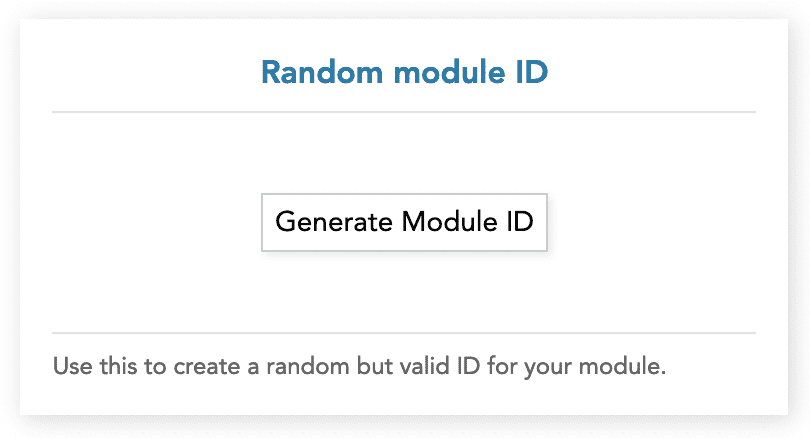

# Fluidspace Integration Module Template v0.1 (Vue 3)

This is the starter template to develop Modules of ***Integration*** type for [Fluidspace](https://fluidspace.app).<br>
It is recommended to use this as the base for any new module development for consistent and smoother experience.


<details>
<summary>More...</summary>

This template contains basic code structure including the Factory and environment simulation definitions.

The template uses **Vue 3 + Vite** and trimmed-down version of JS files that are used on Fluidspace to invoke and handle modules.

The Vite bundling and build configuration are already defined, we recommend to not change any of it.

The final build is an IIFE with .js in *dist/js/* and all the static assets in *dist/assets/* directory.
Due to the nature of current build process, the built (dist) files may not be directly servable (i.e. independent of Fluidspace Environment).
</details>

<!-- <br> Configuring & using template video guide: [YouTube](#) -->

### 🤔 What's different from App type? 

| Feature Available           | Integration | App |
|-----------------------------|-------------|-----|
| REST API - fetch()          | ✅          | ✅   |
| REST API - OAuth2 fetch()   | ✅          | ❌   |
| REST API - HTTP Key fetch() | 🟡 soon     | ❌   |
| Database - DataAPI          | ❌          | ✅   |
| Database - PropsAPI         | ❌          | ✅   |
| Real-time data events       | ❌          | ✅   |
| Datasets                    | ❌          | ✅   |
| Companion Module            | 🟡 soon     | ✅   |

## 🔖 Docs Index
* [What is Fluidspace?](https://gist.github.com/rishiktiwari/645f48422aad7ca7781d1142b3f3b1bd)
* [Integration Documentation](docs/Integration.md)


## 🔴 Pre-requisites
- Installed and running [Fluidspace Development Server](https://github.com/FluidspaceWeb/development-server)
- Node.js v18+
- Copy of this repo

<details>
<summary>Recommended IDE Setup</summary>

[VSCode](https://code.visualstudio.com/) + [Volar](https://marketplace.visualstudio.com/items?itemName=Vue.volar) (and disable Vetur).
</details>

## 🟡 Pre-development

### ⬇️ Download Template
```sh
git clone https://github.com/FluidspaceWeb/integration-template-vue3.git
```

> **Generate random module ID**
>
> Click the generate module ID button and copy it.
>
> *Note: This ID is only for development purpose and will be changed automatically when publishing to fluidspace marketplace via the developer platform (coming soon).*
<details>
<summary>See Image</summary>
<div align="center">
   
</div>
</details>

### 📄 Template Configuration

1. Open the [index.html](index.html) and set the following parameters:
    ```js
    {
        "serverUrl": "http://localhost:1822",
        "module": {
            "id": "<valid module id>",
            "namespace": "<namespace>",
            "name": "<modulename>",
            "displayName": "My Integration"
        },
        "autoSelectAccount": {
            "enabled": true,    // enable or disable auto account selection
            "id": "",           // account id to select
            "delayMS": 500      // auto select account delay
        }
    }
    ```
    Ideally, match the `namespace` to the one specified in development server.

    To get `autoSelectAccount.id`, read [this](docs/Integration.md#👥-fetching-all-oauth2-accounts).

2. Open [main.js](src/main.js) and set the **namespace** and **modulename** in the following line:
    ```js
    customElements.define("module-<namespace>_<modulename>", ...)
    ```

3. Similarly, open [App.ce.vue](src/App.ce.vue) set the **_MODULE_ID, namespace** and **mod_name**.

### 💿 Development Server Setup

> **This step is only required if the REST API that your integration is accessing uses OAuth2 authentication.**
>
> API Key authentication is currently not supported. But you can prompt user to fill API key and store it in sessionStorage with key name as your module's ID but, do not use localStorage.
> 
> For HTTP basic authentication, a prompt can be shown to user for the credentials.

<details>
<summary>Read me if integration uses OAuth2</summary>

<div align="center">


Example - Fluidspace Development Server
</div>

> Note: PKCE is not supported!

1. Visit development server UI on [localhost:1822](http://localhost:1822) and add OAuth2 configuration for your integration.

1. Specify a relevant and friendly *auth provider name*, this will be used by your module to invoke the appropriate OAuth2 config during runtime. Please ensure to keep the *auth provider name* name unique within your integration, else it will overwrite any previous configs with same name.

1. Enter the config JSON in following structure and click submit.
    ```ts
    {
        "authType": "OAuth2",
        "allowedHosts": string[],   // allowed API origins (Ex. https://api.someservice.tld)
        "secret": {                 // never sent to the frontend
            "client_secret": string
        },
        "nonSecret": {              // may be sent to the frontend
            "client_id": string,
            "scope": string         // scope to be consented from user (Ex. openid profile email)
        },
        "tokenExchangeURL": string, // URL to exchange refresh_token for fresh access_token
        "authGrantURL": string      // URL for initial auth_code exchange for refresh & access token
    }
    ```
</details>

## 🟢 Development Setup
```sh
npm install
```

### Bundle and launch for Development
```sh
npm run dev
```

*Ignore the testbench.js warning: Failed to load url /testbench.js...*

### Bundle for Production

> Please set the `_MODULES_CDN_BASE_URL` with your ***namespace*** and ***modulename*** in [vite.config.js](vite.config.js) before building and submitting request to upload fluidspace.app.

```sh
npm run build
```

## 📙 Things to consider during development

1. Use browser's `fetch()` or AJAX to request external APIs unless OAuth2 authentication & credentials are required. For the latter, use `IntegrationGlue.directRequest()` and it will automatically add the respective **access_token** to request header.

1. If using OAuth2, It is recommended to show a empty screen asking user to select an account when no account is selected.

1. Keep the module concise in terms of features and capabilities. Better to split the features as separate module if not directly related and, use all the modules together as *companion (coming soon for integration)*.

1. Remember that multiple instance of same module may be loaded simultaneously, which overrides the global or file level variables. Therefore, use OOP approach to create instance of such variables in [App.ce.vue](src/App.ce.vue) and pass the instantiated object as *props* or use `provide/inject`.

1. The sub-components do not require `.ce.vue` file extension and it is recommended to use only `.vue`.

1. The Vite build includes Vue framework and must **not** be made external. We know that this increases the file size but allows usage of different versions and frameworks in the same Space.

1. There are some known issues with hot-reload not triggering for CSS changes, until then prefer manual refresh.

1. Using `<style>` in sub-components does not work correctly, until then keep `.css` separate and import as many as required in [App.ce.vue](src/App.ce.vue). Example:
    ```html
    <style type="text/css" src="@/assets/base.css" />
    ```

## 🧩 Using Factory in components
Fluidspace supports launching of multiple instances of the module which requires [Factory](src/shared/Factory.js) to be encapsulated for each instance.

The [App.ce.vue](src/App.ce.vue) uses Vue's `provide()` to make the instantiated Factory injectable in any component using `inject('FACTORY')`.

*Note: inject does not support type-check.*

## 📧 Submit module to publish on Fluidspace.app

Email me on [rishik@fluidspace.app](mailto:rishik@fluidspace.app) along with the module files for review and publishing.

The online developer platform is currently under development 😅 and should be live soon.

## ✏️ Roadmap
- Type definition
- Template as npm package
- Testbench toast alert support
- Improve path definition for static assets
