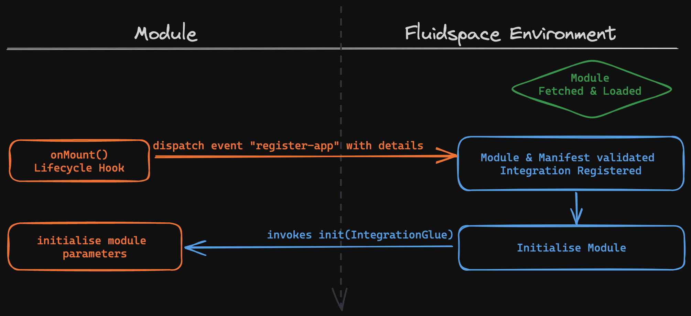
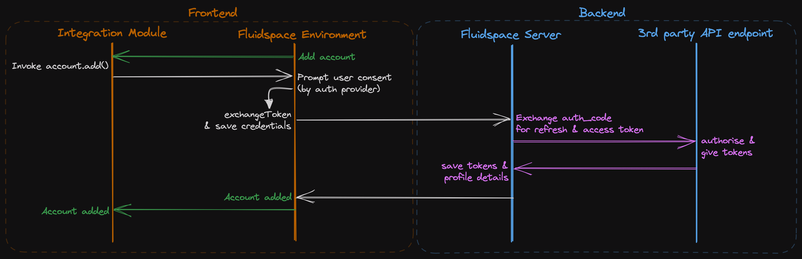
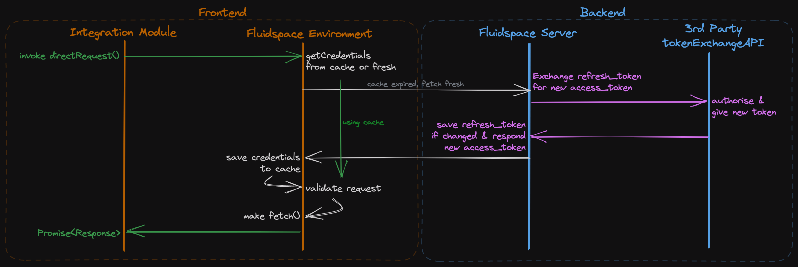

# Integration Documentation

This document explain the module registration with Fluidspace environment, account adding and OAuth2 REST API request flow. The document lists the provided attributes, methods and event listeners.

## 🔖 Docs Index
* [What is Fluidspace?](https://gist.github.com/rishiktiwari/645f48422aad7ca7781d1142b3f3b1bd)
* [Installation Guide](/README.md)

## ✍️ Module Registration Flow
<div align="center">
    

*Inner data/event flow of environment and module are not shown for the sake of simplicity.*
</div>

<br>

## 🛡 OAuth2 Flow

### 🔹 Add account

<div align="center">


*Inner data/event flow of environment and module are not shown for the sake of simplicity.*
</div>

### 🔹 directRequest() for OAuth2

Fluidspace server acts as [Token-Mediating Backend](https://datatracker.ietf.org/doc/html/draft-ietf-oauth-browser-based-apps#name-token-mediating-backend).

The secrets and refresh token are never sent to the frontend, only the access token is made available.

> Note: PKCE is not supported!

<div align="center">


*Inner data/event flow of environment and module are not shown for the sake of simplicity.*
</div>

When using the development server, the credentials are cached to sessionStorage whereas it is stored in-memory in the production version of Fluidspace environment.


## 👤 Adding OAuth2 account

The command simulates how Fluidspace environment would trigger **add account auth** in your module.
If the module is configured and developed correctly then the authentication flow must begin and on completetion the auth credentials are stored to the database.

> Do not use this in module, the function is only available for development and simulation purpose.

Run the following command in **browser** console:
```js
App.Integration.triggerAddAccount() 
```


## 👥 Fetching all OAuth2 accounts

Retrieve all the OAuth2 accounts that have been added.

> Do not use this in module, the function is only available for development and simulation purpose.

Run the following command in **browser** console:
```js
App.Integration.getAllAccounts()
```

### ↳ Auto account selection (for development only):

Get account **id** by invoking the above command, then specify the `accounts[]._id` to the config in [index.html](index.html) property: `autoSelectAccount.id`.

Example response:
```js
{
    "request_status": 1,
    "accounts": [
        {
            "_id": "64beaf2155015", // note this
            "auth_on": "1690218273348",
            "auth_type": "OAuth2",
            "auth_provider_name": "microsoft", // note this
            "credentials": {
                "profile": {
                    "email": "useremail@domain.tld",
                    "name": "FirstName SecondName"
                },
                "scope": "",
                "sub": "",
                "issuer": ""
            }
        }
    ]
}
```

## 🫧 Dispatching "register-app" event
Create a custom event dispatcher to dispatch event from the shadow root of the module when the `onMount()` or ***any similar*** lifecycle hook is invoked. In VueJS this can be achieved by using `defineEmit()` in **src/App.ce.vue**.

The event must be named `register-app` with the following detail:
```ts
{
    id: string,         // Module ID
    namespace: string,  // Module namespace (a-z0-9, ideally same as in dev server)
    mod_name: string,   // Module name, (a-z0-9)
    init: Function,     // Method invoked by environment for initialisation (invoked only once)
    refresh: Function   // Invoked by user for refreshing/refetching data
}
```

<details>
<summary>Example Vue3 implementation</summary>

```js
const emit = defineEmits([ 'register-app' ]);

onMounted(() => {
    emit('register-app', {
        id: 'QnlSaXNoaWtUaXdhcmk=',
        namespace: 'auriva',
        mod_name: 'awesomeintegration',
        init: initialise,
        refresh: refresh
    });
});

function initialise(IntegrationGlue) { ... }
function refresh() { ... }
```

⬆️ The above example is for Vue setup API.

</details>

<br>

## 🤝 IntegrationGlue Definition

The `IntegrationGlue` object contains several properties and methods to "***glue***" the module with Fluidspace environment and its features. The environment via Glue acts as proxy between module and server to trigger other events, handle error and other redundant aspects.

The `IntegrationGlue` object is provided as parameter to the method defined in `init` as outcome of module's `register-app` event.

#### Properties:
```ts
IntegrationGlue = {
    directRequest(url: string, headers: Headers, payload: any): Promise, // proxies browser's fetch()
    getConfig(): object, // containing parsed module's manifest.json
    account: {
        add(access_type: string, auth_provider_name: string), // invokes add account flow
        select(account_id: string, access_type: string), // invoke to confirm onAccountSelect event
        clearSelected(): void,
        getSelected(): {'account_id': string, 'access_type': string}
    },
    subscribe: {
        onAddAccount(handler: Function) // use to initiate auth flow by invoking account.add()
        onAccountRemoved(handler: Function), // use to update UI if required
        onAccountSelect(handler: Function), // use to re-fetch data for selected account
    },
    unsubscribe: {
        onAddAccount()
        onAccountRemoved(),
        onAccountSelect(),
    }
}
```

### Understanding event subscriptions

> If your integration does not use REST API that requires OAuth2 authentication then don't worry about `account{}, subscribe{}, unsubscribe{}` properties.
> Just continue to use browser's fetch to make 3rd party API requests and skip this.

* onAddAccount
   <br>When: User clicks "add account" button in the Fluidspace environment.
   <br>Expectation: Module must subscribe to this and invoke `IntegrationGlue.account.add()`
   <br>Result: OAuth2 flow is initiated and account along with its credential tokens are saved.

* onAccountRemoved
    <br>When: User clicks "delete account" in the Fluidspace environment.
    <br>Expectation: Module must check if selected account is same as account to delete, if yes then clear all data from UI, rest will be handled by environment.
    <br>Result: Account is deleted and empty module is shown.

* onAccountSelect
    <br>When: User selects account from dropdown list in environment.
    <br>Expectation: Forward event by invoking `IntegrationGlue.account.select()`, and continue too fetch & initialise the module data for the selected account. 
    <br>Result: Account is selected and module data is initialised by fetching 3rd party API.

<br>

## 👂 Environment Event Listeners

### 🔹 register-app

To register the module and initialise it.

### 🔹 show-toast 

To trigger Environment toast notification.
***Remember to dispatch event from the root element if the event does not bubbles.***

Required parameters in event `detail`:
```ts
{
    severity_type: ('error' | 'warn' | 'info' | 'success'),
    message: string
}
```

<br>

## 🏷 Module HTML Attributes
| attribute name | definition |
|----------------|------------|
| data-mid       | Module ID  |
| period-start | Environment date range start value (in ms) | 
| period-end | Environment date range end value (in ms) | 

> Any other attribute must not be depended on. 
